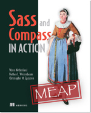
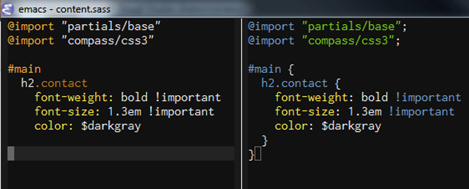
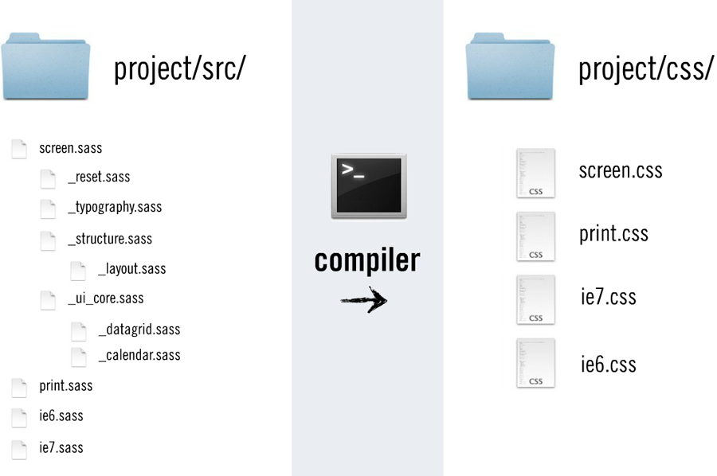
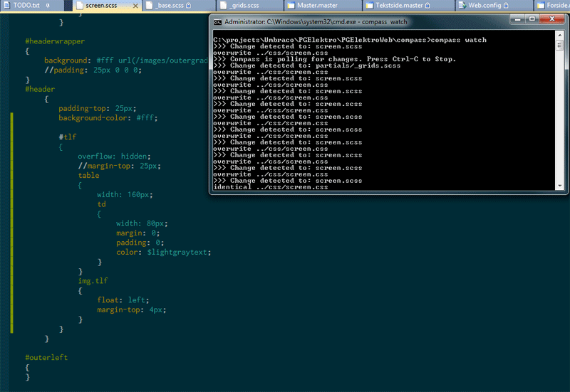
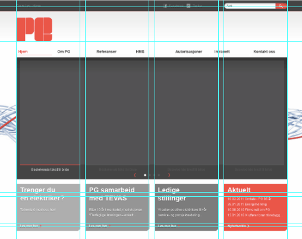
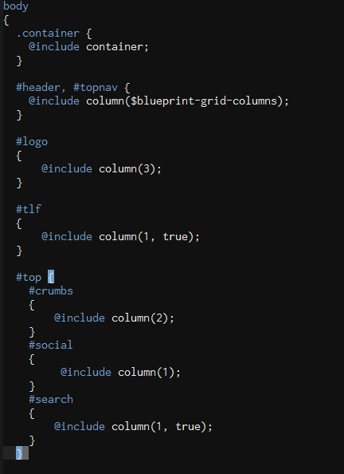

!SLIDE
# compass

## en rask introduksjon

!SLIDE

# meg:
## Bjørn Arild Mæland
## Utvikler hos Reaktor Kyber
## [@bmaland](http://twitter.com/bmaland)

!SLIDE bullets incremental
# compass er

* et meta-rammeverk
* et standard-bibliotek
* utvidbart!

!SLIDE center

!SLIDE
# compass bygger på
# SASS

!SLIDE center

!SLIDE
# sass/scss

## gjør css programmerbart

!SLIDE
# sass/scss

## to ulike syntax

!SLIDE center
# sass/scss

!SLIDE bullets incremental
# sass/scss
## scss = superset av css!

!SLIDE bullets incremental
# sass/scss

* variabler
* funksjoner
* mixins

!SLIDE bullets incremental
# sass/scss

* nøsting
* "arv" av css klasser
* automatisk css minifisering
* mer!

!SLIDE center

!SLIDE center

!SLIDE bullets incremental
# grid frameworks

## implementeres som plugins i compass

* blueprint
* 960.gs
* susy
* og flere

!SLIDE bullets incremental
# eksempler!

!SLIDE

    @@@css
    #main p {
      color: #00ff00;
      width: 97%;

      .redbox {
        background-color: #ff0000;
        color: #000000;
      }
    }

!SLIDE
    @@@css
    #main p {
      color: #00ff00;
      width: 97%;
    }

    #main p .redbox {
      background-color: #ff0000;
      color: #000000;
    }

!SLIDE
    @@@css
    .funky {
      font: {
        family: Arial;
        size: 30em;
        weight: bold;
      }
    }

!SLIDE
    @@@css
    .funky {
      font-family: fantasy;
      font-size: 30em;
      font-weight: bold;
    }

!SLIDE

    @@@css
    a {
      text-decoration: none;

      &:hover {
        text-decoration: underline; } }

!SLIDE

    @@@css
    a {
      text-decoration: none;
    }

    a:hover {
        text-decoration: underline;
    }

!SLIDE
    @@@css
    // These comments are one line long each
    // They won't appear in the CSS output

!SLIDE

    @@@ php
    $reservoir: #432a80;
    $well: #008c6c;
    $facilities: #CCCC00;
    $consultancy: #f28411;
    $hseq: #cc0c00;
    $software: #003049;

!SLIDE

    @@@ css
    #menu {
      background-color: $hseq;
    }

!SLIDE

    @@@ css
    #menu {
      background-color: #cc0c00;
    }

!SLIDE

    @@@ php
    $basemargin: 12px;
    $doublemargin: $basemargin * 2;

    $link: #4d91d3;
    $linkvisited: darken($link, 15%);

!SLIDE

    @@@ css
    @for $i from 1 through 3 {
      .item-#{$i} { width: 2em * $i; }
    }

!SLIDE

    @@@ css
    .item-1 {
      width: 2em; }
    .item-2 {
      width: 4em; }
    .item-3 {
      width: 6em; }

!SLIDE

    @@@css
    .error {
      border: 1px #f00;
      background-color: #fdd; }

    .seriousError {
      @extend .error;
      border-width: 3px; }

!SLIDE

    @@@css
    .error, .seriousError {
      border: 1px #f00;
      background-color: #fdd;
    }

    .seriousError {
      border-width: 3px;
    }

!SLIDE

    @@@php
    @mixin colortheme($color)
      #main-column a {
        color: $color !important;
        &.button {
          color: #fff !important;
          background-color: $color; }}

      #left-box {
        background-color: $color; }

!SLIDE

    @@@css
    .reservoir {
      @include colortheme($reservoir);
    }

    .well {
      @include colortheme($well);
    }

!SLIDE center

# css reset

    @@@css
    @include global-reset;

!SLIDE

# css3!

!SLIDE

    @@@css
    .simple {
      @include border-radius(4px, 4px);
    }

!SLIDE

    @@@css
    .simple {
      -webkit-border-radius: 4px 4px;
      -moz-border-radius: 4px / 4px;
      -o-border-radius: 4px / 4px;
      -ms-border-radius: 4px / 4px;
      -khtml-border-radius: 4px / 4px;
      border-radius: 4px / 4px;
    }

!SLIDE

    @@@css
    h2 {
      @include opacity(50);
    }

!SLIDE

    @@@css
    h2 {
      opacity: 0.5;
      -moz-opacity: 0.5;
      -khtml-opacity: 0.5;
      -ms-filter: DXImageTransform osv;
      filter: alpha(opacity=50);
    }

!SLIDE center

## stor nytteverdi med et standardbibliotek
## tilpasses nye browsere o.l., oppgradering av
## compass er alt som er nødvendig

!SLIDE

# blueprint

!SLIDE

    @@@php
    @import "blueprint";

!SLIDE
    @@@css
    $blueprint-grid-columns: 24;
    $blueprint-grid-width: 30px;
    $blueprint-grid-margin: 10px;

!SLIDE
# Oppdater variablene med verdier fra PSDen

## Sparer _veldig_ mye tid!

!SLIDE center

!SLIDE center

!SLIDE

# [http://compass-style.org/](http://compass-style.org/)

# [http://sass-lang.org/](http://sass-lang.org/)
